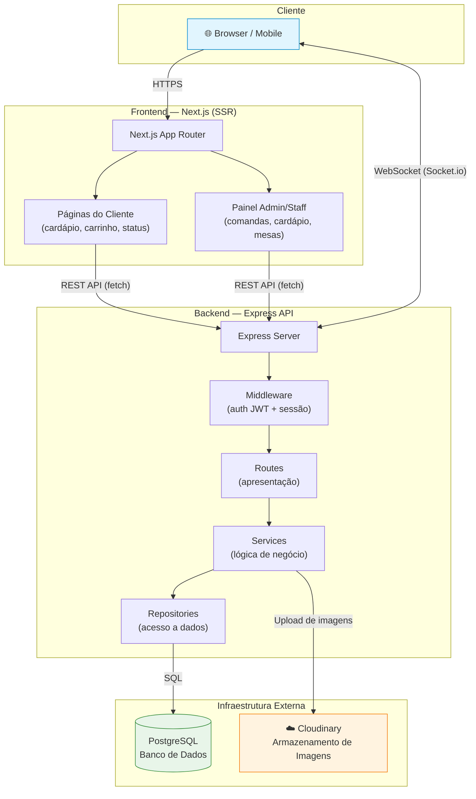
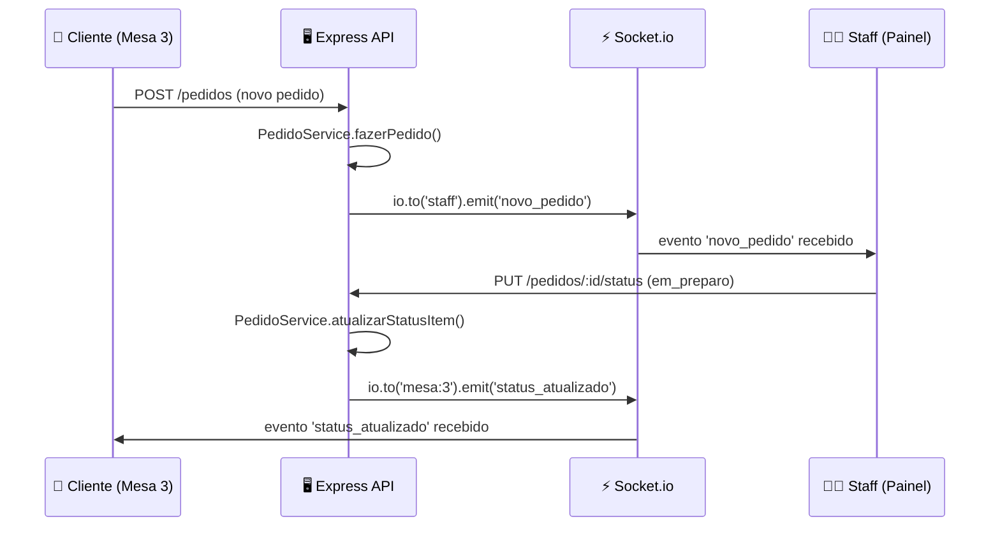

# Arquitetura e Design — cardap.io

> Disciplina de Engenharia de Software 2026.1 — UNIFAP  
> Projeto Integrador: Sistema de Cardápio Digital com Gerência de Comandas

---

## 1. Padrão Arquitetural

O **cardap.io** adota uma combinação de **Arquitetura em Camadas (Layered Architecture)** com **Cliente-Servidor**.

### Cliente-Servidor

O sistema é dividido em duas partes claramente separadas:

- **Cliente** — aplicação Next.js executada no navegador (com SSR no servidor), responsável pela interface do usuário (cardápio digital, carrinho, painel administrativo).
- **Servidor** — API Express que concentra toda a lógica de negócio, autenticação, persistência e comunicação em tempo real.

A comunicação ocorre exclusivamente via **HTTP/REST** para operações CRUD e **WebSocket (Socket.io)** para eventos em tempo real.

### Arquitetura em Camadas (Layered)

No backend, o código está organizado em camadas com responsabilidades bem definidas:

| Camada | Diretório | Responsabilidade |
|--------|-----------|------------------|
| **Apresentação (Routes)** | `src/routes/` | Recebe requisições HTTP, valida parâmetros, delega para os serviços e retorna respostas JSON. |
| **Lógica de Negócio (Services)** | `src/services/` | Orquestra regras de negócio, coordena repositórios e emite eventos via Socket.io. |
| **Acesso a Dados (Repositories)** | `src/repositories/` | Abstrai o acesso ao banco de dados. As interfaces em `interfaces.ts` definem contratos; as implementações em `postgres/` executam queries SQL reais. |
| **Infraestrutura (Middleware)** | `src/middleware/` | Autenticação JWT, validação de sessão do cliente e controle de acesso por role. |

### Justificativa da Escolha

1. **Tamanho da equipe (5 pessoas)**: Uma arquitetura mais complexa (ex.: microserviços) adicionaria overhead desnecessário para um time pequeno. A divisão em camadas permite que diferentes membros trabalhem em camadas distintas (ex.: um no repositório, outro na rota) sem conflitos frequentes de merge.

2. **Escopo do projeto (MVP acadêmico)**: O cardap.io é um sistema monolítico com domínio bem delimitado (restaurante → cardápio → pedidos → comandas). Não há necessidade de escalar horizontalmente partes isoladas do sistema nesta fase.

3. **Separação de responsabilidades**: Cada camada depende apenas da camada imediatamente abaixo. As rotas nunca acessam o banco diretamente — delegam para os serviços, que delegam para os repositórios. Isso facilita testes, refatoração e troca de implementações (ex.: trocar PostgreSQL por outro banco requer apenas nova implementação dos repositórios, sem alterar as interfaces).

---

## 2. Diagrama de Arquitetura



### Fluxo Principal — Cliente

```
QR Code escaneado → Token validado pela API → Sessão criada →
Mesa e comanda vinculadas → Acesso ao cardápio liberado →
Pedidos enviados via REST → Status atualizado em tempo real via WebSocket
```

### Fluxo Principal — Funcionário/Admin

```
Login com e-mail/senha → JWT emitido (8h) → Painel administrativo →
Comandas abertas carregadas via REST → Atualizações em tempo real via Socket.io
```

---

## 3. Princípios SOLID Aplicados

### 3.1 SRP — Single Responsibility Principle (Princípio da Responsabilidade Única)

Cada classe de serviço possui **uma única responsabilidade**, limitada a um domínio específico do sistema:

| Serviço | Responsabilidade Única |
|---------|----------------------|
| `CardapioService` | Consulta de itens do cardápio |
| `PedidoService` | Criação de pedidos e atualização de status |
| `MesaService` | Gerenciamento de mesas e comandas |
| `SessaoService` | Autenticação via QR Code e ciclo de vida da sessão |

**Exemplo concreto** — [`CardapioService.ts`](../backend/src/services/CardapioService.ts):

```typescript
export class CardapioService {
  constructor(private cardapioRepo: ICardapioRepository) {}

  async listarItensDisponiveis(): Promise<ItemCardapio[]> {
    return this.cardapioRepo.listarDisponiveis();
  }

  async buscarItemPorId(id: number): Promise<ItemCardapio | null> {
    return this.cardapioRepo.buscarPorId(id);
  }
}
```

A classe contém **apenas** métodos relacionados à consulta do cardápio. Ela não lida com pedidos, autenticação ou mesas. Se a regra de listagem do cardápio mudar (ex.: filtrar por horário), apenas esta classe é modificada.

**Exemplo concreto** — [`middleware/auth.ts`](../backend/src/middleware/auth.ts):

O middleware de autenticação é separado em três funções independentes, cada uma com uma responsabilidade:

```typescript
// Apenas valida token JWT para staff
export function requireAuth(req, res, next): void { ... }

// Apenas verifica role (admin ou funcionário)
export function requireRole(role: 'admin' | 'funcionario') { ... }

// Apenas valida sessão de cliente via QR Code
export function makeRequireSessaoCliente(validarSessaoFn) { ... }
```

Cada função é **composível** e pode ser usada isoladamente nas rotas conforme a necessidade de proteção.

---

### 3.2 DIP — Dependency Inversion Principle (Princípio da Inversão de Dependência)

Os serviços **não dependem de implementações concretas** de acesso a dados — dependem de **interfaces abstratas** (contratos). A implementação concreta (PostgreSQL) é injetada via construtor.

**Exemplo concreto** — [`repositories/interfaces.ts`](../backend/src/repositories/interfaces.ts):

```typescript
// ============================================================
// Interfaces dos repositórios — NUNCA alterar ao trocar de DB
// Trocar de mock → postgres = criar nova implementação aqui
// ============================================================

export interface ICardapioRepository {
  listarDisponiveis(): Promise<ItemCardapio[]>;
  buscarPorId(id: number): Promise<ItemCardapio | null>;
}

export interface IPedidoRepository {
  criar(comanda_id: number, itens: NovoPedidoItem[]): Promise<PedidoItem[]>;
  atualizarStatus(id: number, status: StatusPedido): Promise<PedidoItem | null>;
  listarPorComanda(comanda_id: number): Promise<PedidoItem[]>;
  listarComandasAbertas(): Promise<ComandaComItens[]>;
}
```

**Injeção de dependência** — [`server.ts`](../backend/src/server.ts):

```typescript
// Instâncias dos repositórios (implementação concreta: PostgreSQL)
const cardapioRepo = new CardapioRepository();
const pedidoRepo   = new PedidoRepository();

// Serviços recebem a interface, não a implementação
const cardapioService = new CardapioService(cardapioRepo);
const pedidoService   = new PedidoService(pedidoRepo, io);
```

**Benefício**: Para trocar de PostgreSQL para outro banco (ou para mocks em testes), basta criar uma nova classe que implemente a interface (`ICardapioRepository`, `IPedidoRepository`, etc.) — os serviços não precisam ser alterados. O próprio comentário no código confirma essa intenção de design: _"Trocar de mock → postgres = criar nova implementação aqui"_.

---

## 4. Design Patterns Utilizados

### 4.1 Repository Pattern (Padrão Repositório)

**O que é:** Abstrai o acesso a dados por trás de uma interface, isolando a lógica de negócio dos detalhes de persistência (SQL, ORM, API externa, etc.).

**Onde é aplicado:**

| Interface | Implementação Concreta | Diretório |
|-----------|----------------------|-----------|
| `ICardapioRepository` | `CardapioRepository` | `repositories/postgres/` |
| `IMesaRepository` | `MesaRepository` | `repositories/postgres/` |
| `IPedidoRepository` | `PedidoRepository` | `repositories/postgres/` |
| `ISessaoRepository` | `SessaoRepository` | `repositories/postgres/` |

**Exemplo** — [`CardapioRepository.ts`](../backend/src/repositories/postgres/CardapioRepository.ts):

```typescript
export class CardapioRepository implements ICardapioRepository {
  async listarDisponiveis(): Promise<ItemCardapio[]> {
    const res = await pool.query(
      'SELECT id, nome, descricao, preco, categoria, disponivel, imagem_url FROM cardapio_itens WHERE disponivel = true'
    );
    return res.rows.map((row) => ({
      id: row.id,
      nome: row.nome,
      descricao: row.descricao,
      preco: parseFloat(row.preco),
      categoria: row.categoria,
      disponivel: row.disponivel,
      imagem_url: row.imagem_url,
    }));
  }
}
```

**Por que foi usado:** O Repository Pattern permite que o `CardapioService` chame `this.cardapioRepo.listarDisponiveis()` sem saber se os dados vêm do PostgreSQL, de um banco em memória ou de uma API externa. Isso simplifica testes unitários (injetando um repositório mock) e facilita migrações futuras de banco de dados.

---

### 4.2 Observer Pattern (Padrão Observador) — via Socket.io

**O que é:** Define uma dependência um-para-muitos entre objetos: quando um objeto muda de estado, todos os seus dependentes (observadores) são notificados automaticamente.

**Onde é aplicado:** O Socket.io implementa o padrão Observer para atualização de status de pedidos em tempo real. O servidor **emite eventos** (publisher) e os clientes conectados **escutam e reagem** (subscribers).

**Publisher** — [`PedidoService.ts`](../backend/src/services/PedidoService.ts):

```typescript
async fazerPedido(comanda_id: number, itens: NovoPedidoItem[]): Promise<PedidoItem[]> {
  const itensCriados = await this.pedidoRepo.criar(comanda_id, itens);

  // Emite para o painel do staff via Socket.io (publisher → subscribers)
  this.io.to('staff').emit('novo_pedido', {
    comanda_id,
    mesa_numero: comanda?.mesa_numero ?? '?',
    itens: itensCriados,
  });
  return itensCriados;
}

async atualizarStatusItem(id: number, status: StatusPedido): Promise<PedidoItem> {
  const atualizado = await this.pedidoRepo.atualizarStatus(id, status);

  // Emite para a mesa específica (notifica apenas o cliente afetado)
  this.io.to(`mesa:${comanda.mesa_id}`).emit('status_atualizado', {
    pedido_item_id: atualizado.id,
    status: atualizado.status,
    item_nome: atualizado.item_nome,
  });
  return atualizado;
}
```

**Subscribers** — [`socket/events.ts`](../backend/src/socket/events.ts):

```typescript
export function setupSocketEvents(io: SocketServer): void {
  io.on('connection', (socket) => {
    // Cliente da mesa entra na room dela (subscribe)
    socket.on('join_mesa', (data: { mesaId: number }) => {
      socket.join(`mesa:${data.mesaId}`);
    });

    // Staff entra na room do painel (subscribe)
    socket.on('join_staff', () => {
      socket.join('staff');
    });
  });
}
```

**Por que foi usado:** O fluxo do restaurante exige que mudanças de status em pedidos sejam refletidas **imediatamente** tanto para o cliente (que acompanha seu pedido) quanto para o funcionário (que vê novos pedidos chegando). O padrão Observer via Socket.io permite essa comunicação reativa sem que o cliente precise fazer polling na API — o servidor notifica automaticamente todos os interessados quando o estado muda.

**Fluxo de eventos:**



---

## 5. Tecnologias Utilizadas

| Tecnologia | Versão | Função | Justificativa |
|-----------|--------|--------|---------------|
| **TypeScript** | ^5.4.5 | Linguagem (backend e frontend) | Tipagem estática permite mapeamento direto entre classes UML e código. Enums, interfaces e `readonly` traduzem conceitos de encapsulamento do diagrama de classes. Stack unificada (Node.js + React) reduz a curva de aprendizado da equipe. |
| **Next.js** | — | Framework frontend | SSR (Server-Side Rendering) melhora performance e SEO. File-based routing simplifica a organização de páginas. Ecossistema React permite componentização da interface do cardápio. Route Handlers servem como proxy seguro para a API. |
| **Express** | ^4.19.2 | Framework backend (API REST) | Leve e flexível, permite configuração granular via middleware. Amplo ecossistema de bibliotecas compatíveis. Integração nativa com Socket.io para tempo real. Ideal para APIs REST com lógica de negócio moderada. |
| **PostgreSQL** | — | Banco de dados relacional | Integridade referencial forte via foreign keys e constraints (CHECK, UNIQUE, NOT NULL). Suporte a transações ACID — essencial para operações como criação de pedidos com múltiplos itens. Tipos de dados nativos (UUID, TIMESTAMP, DECIMAL) adequados ao domínio. |
| **Socket.io** | ^4.7.5 | Comunicação em tempo real | Protocolo bidirecional (WebSocket com fallback HTTP long-polling) para atualização instantânea de status de pedidos. Conceito de "rooms" permite segmentar mensagens por mesa ou painel do staff. |
| **Cloudinary** | ^2.10.0 | Armazenamento de imagens | Serviço gerenciado para upload, transformação e CDN de imagens dos itens do cardápio. Evita armazenar binários no banco de dados ou no servidor. Transformações automáticas (resize, formato) otimizam carregamento em dispositivos móveis. |
| **bcrypt** | ^6.0.0 | Hashing de senhas | Algoritmo de hashing com salt automático e fator de custo configurável (≥ 10, conforme RNF-04). Resistente a ataques de força bruta e rainbow tables. Padrão da indústria para armazenamento seguro de credenciais. |
| **JSON Web Token (JWT)** | ^9.0.3 | Autenticação stateless | Tokens com expiração de 8 horas (conforme RNF-04) eliminam a necessidade de sessões server-side para o staff. Payload contém id, email e role — dispensando consulta ao banco em cada request autenticada. Verificação via `middleware/auth.ts`. |
| **Multer** | ^2.2.0 | Upload de arquivos | Middleware Express para tratamento de `multipart/form-data`. Configuração de limites de tamanho (5 MB, conforme US-06) e tipos MIME aceitos (JPG, PNG). Integrado ao fluxo de upload para Cloudinary. |
| **node-qrcode** | ^1.5.4 | Geração de QR Codes | Gera imagens PNG dos QR Codes vinculados às mesas (US-10). Exportação para impressão e colagem nos cartões físicos entregues aos clientes. |
| **pg** | ^8.12.0 | Driver PostgreSQL para Node.js | Client nativo com pool de conexões, suporte a queries parametrizadas (prevenção de SQL injection) e transações explícitas (`BEGIN/COMMIT/ROLLBACK`). |
| **dotenv** | ^16.4.5 | Variáveis de ambiente | Carrega configurações sensíveis (credenciais do banco, chave JWT, URL do Cloudinary) de arquivo `.env`, evitando hardcode no repositório. |

---

## Referências

- [README do projeto](../README.md)
- [User Stories e Requisitos](../user-stories.md)
- [Banco de Dados — Entidades e Relacionamentos](database.md)
- [Decisões de Modelagem](decisoes-modelagem.md)
- [Diagrama de Classes](diagrama-classes.md)
