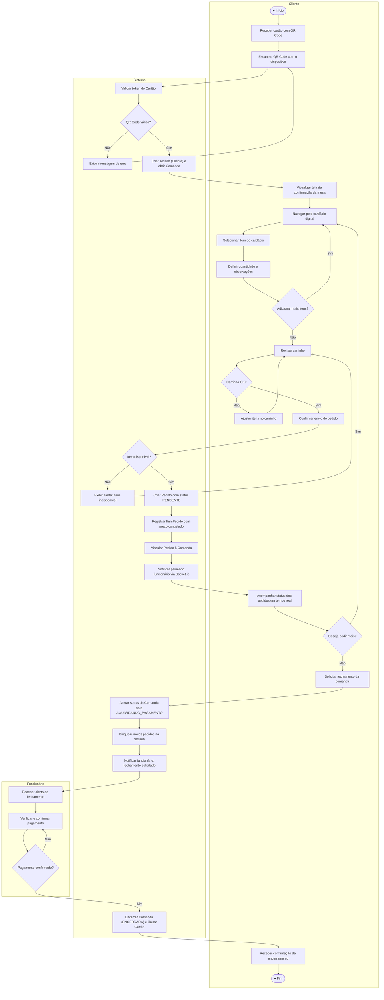

# Diagrama de Atividades — cardap.io

> Disciplina de Engenharia de Software 2026.1 — UNIFAP

---

## Visão Geral

O diagrama de atividades abaixo modela o **fluxo completo do cliente** no sistema cardap.io, desde a chegada ao restaurante até o encerramento da comanda. As raias (swimlanes) separam as responsabilidades entre três participantes: **Cliente**, **Sistema** e **Funcionário**.

O diagrama cobre os seguintes casos de uso:
- UC-01 — Autenticar via QR Code
- UC-02 — Visualizar Cardápio
- UC-03 — Realizar Pedido
- UC-07 — Acompanhar Status do Pedido
- UC-08 — Solicitar Fechamento de Comanda
- UC-04 — Gerenciar Comanda (perspectiva do funcionário)

---

## Diagrama



---

## Legenda

| Símbolo | Significado UML |
|---------|-----------------|
| ● (círculo preenchido) | Nó inicial / Nó final |
| Retângulo | Ação (atividade) |
| Losango | Nó de decisão |
| Raias (subgraphs) | Swimlanes — separação de responsabilidades por ator |
| Setas | Fluxo de controle entre atividades |

---

## Mapeamento para Classes do Diagrama de Classes

| Atividade | Classe(s) | Método(s) / Atributo(s) |
|-----------|-----------|-------------------------|
| Escanear QR Code | `Cartao` | `qrCode` (token) |
| Validar token do Cartão | `Cartao` | `validar()` |
| Criar sessão e abrir Comanda | `Cliente`, `Mesa`, `Comanda` | `Cliente.autenticar()`, `Mesa.abrirComanda()` |
| Navegar pelo cardápio | `Categoria`, `ItemCardapio` | `Categoria.itens`, `ItemCardapio.disponivel` |
| Selecionar item | `ItemCardapio` | `nome`, `descricao`, `preco`, `imagemUrl` |
| Criar Pedido | `Pedido` | `status = PENDENTE`, `criadoEm` |
| Registrar ItemPedido | `ItemPedido` | `quantidade`, `observacao`, `precoUnitario` |
| Vincular Pedido à Comanda | `Comanda` | `adicionarPedido(pedido)` |
| Acompanhar status | `Pedido` | `status` (StatusPedido) |
| Solicitar fechamento | `Comanda` | `solicitarFechamento()` |
| Confirmar pagamento | `Funcionario`, `Comanda` | `confirmarPagamento()`, `encerrar()` |
| Liberar Cartão | `Cartao` | `liberar()` |

---

## Transições de Estado Cobertas

### StatusComanda
```
ABERTA → AGUARDANDO_PAGAMENTO → ENCERRADA
```

### StatusPedido
```
PENDENTE → EM_PREPARO → A_CAMINHO → ENTREGUE
```

> As transições de `StatusPedido` são executadas pelo funcionário durante a atividade "Acompanhar status" (ciclo entre UC-04 e UC-07), representadas de forma simplificada no diagrama como a atividade de acompanhamento em tempo real.
