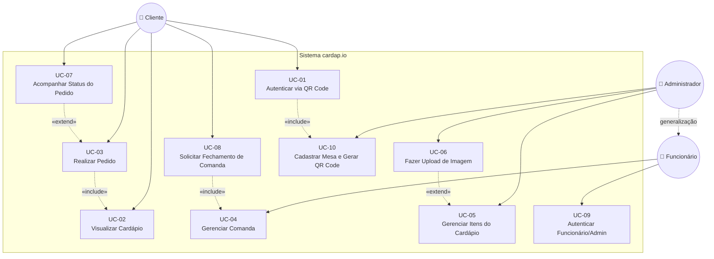

# Diagrama de Casos de Uso — cardap.io

> Disciplina de Engenharia de Software 2026.1 — UNIFAP

---

## Visão Geral

O diagrama abaixo representa os principais casos de uso do sistema **cardap.io**, derivados das [User Stories](../user-stories.md). Os atores foram identificados a partir dos papéis descritos nas histórias: **Cliente** (usuário autenticado via QR Code), **Funcionário** (garçom, cozinheiro ou caixa) e **Administrador** (especialização do funcionário com permissões elevadas).

---

## Diagrama

---

## Atores

| Ator | Descrição | User Stories Relacionadas |
|------|-----------|--------------------------|
| **Cliente** | Pessoa que chega ao restaurante, recebe um cartão com QR Code, e interage com o cardápio digital para fazer pedidos e acompanhar o status. Não possui cadastro — é identificado exclusivamente pelo QR Code. | US-01, US-02, US-03, US-07, US-08 |
| **Funcionário** | Colaborador do restaurante (garçom, cozinheiro, caixa) que acessa o painel administrativo via login com e-mail/senha. Gerencia comandas e atualiza status de pedidos. | US-04, US-09 |
| **Administrador** | Especialização do Funcionário com permissões elevadas. Além de gerenciar comandas, pode manter o cardápio (CRUD de itens, categorias, imagens) e cadastrar mesas/QR Codes. | US-05, US-06, US-09, US-10 |

---

## Casos de Uso

| ID | Caso de Uso | Descrição | Ator(es) |
|----|-------------|-----------|----------|
| UC-01 | Autenticar via QR Code | Cliente escaneia o QR Code do cartão e é vinculado a uma mesa e comanda | Cliente |
| UC-02 | Visualizar Cardápio | Cliente navega pelo cardápio digital com categorias, preços e imagens | Cliente |
| UC-03 | Realizar Pedido | Cliente seleciona itens, ajusta quantidades, adiciona observações e confirma | Cliente |
| UC-04 | Gerenciar Comanda | Funcionário visualiza comandas abertas e atualiza status dos pedidos | Funcionário |
| UC-05 | Gerenciar Itens do Cardápio | Administrador adiciona, edita, marca como indisponível ou remove itens | Administrador |
| UC-06 | Fazer Upload de Imagem | Administrador faz upload de imagem para um item do cardápio | Administrador |
| UC-07 | Acompanhar Status do Pedido | Cliente visualiza em tempo real o status de cada item pedido | Cliente |
| UC-08 | Solicitar Fechamento de Comanda | Cliente visualiza o total e solicita o fechamento para pagamento | Cliente |
| UC-09 | Autenticar Funcionário/Admin | Funcionário ou administrador faz login com e-mail e senha no painel | Funcionário, Administrador |
| UC-10 | Cadastrar Mesa e Gerar QR Code | Administrador cadastra mesas e gera QR Codes para os cartões físicos | Administrador |

---

## Relacionamentos

### «include» (inclusão obrigatória)

| Caso de Uso Base | Caso de Uso Incluído | Justificativa |
|------------------|----------------------|---------------|
| UC-03 (Realizar Pedido) | UC-02 (Visualizar Cardápio) | Para realizar um pedido, o cliente obrigatoriamente precisa visualizar o cardápio e selecionar itens |
| UC-01 (Autenticar via QR Code) | UC-10 (Cadastrar Mesa e Gerar QR Code) | A autenticação do cliente depende da existência prévia de um QR Code gerado e vinculado a uma mesa |
| UC-08 (Solicitar Fechamento) | UC-04 (Gerenciar Comanda) | O fechamento da comanda dispara obrigatoriamente a gerência pelo funcionário para confirmar o pagamento |

### «extend» (extensão opcional)

| Caso de Uso Base | Caso de Uso Extensão | Justificativa |
|------------------|----------------------|---------------|
| UC-05 (Gerenciar Itens do Cardápio) | UC-06 (Fazer Upload de Imagem) | O upload de imagem é opcional ao cadastrar/editar um item — o item pode existir sem imagem |
| UC-03 (Realizar Pedido) | UC-07 (Acompanhar Status do Pedido) | Após realizar um pedido, o cliente pode opcionalmente acompanhar o status em tempo real |

---

## Rastreabilidade: Casos de Uso ↔ User Stories

| Caso de Uso | User Story | Prioridade |
|-------------|------------|------------|
| UC-01 | US-01 — Autenticação do cliente via QR Code | Alta |
| UC-02 | US-02 — Visualização do cardápio digital | Alta |
| UC-03 | US-03 — Realização de pedidos | Alta |
| UC-04 | US-04 — Gerência das comandas pelo estabelecimento | Alta |
| UC-05 | US-05 — Gerenciamento de itens do cardápio | Média |
| UC-06 | US-06 — Upload e exibição de imagens nos itens | Média |
| UC-07 | US-07 — Acompanhamento do status do pedido pelo cliente | Média |
| UC-08 | US-08 — Fechamento de comanda e solicitação de pagamento | Baixa |
| UC-09 | US-09 — Autenticação do administrador e funcionário | Alta |
| UC-10 | US-10 — Cadastro de mesas e geração de QR Codes | Alta |
