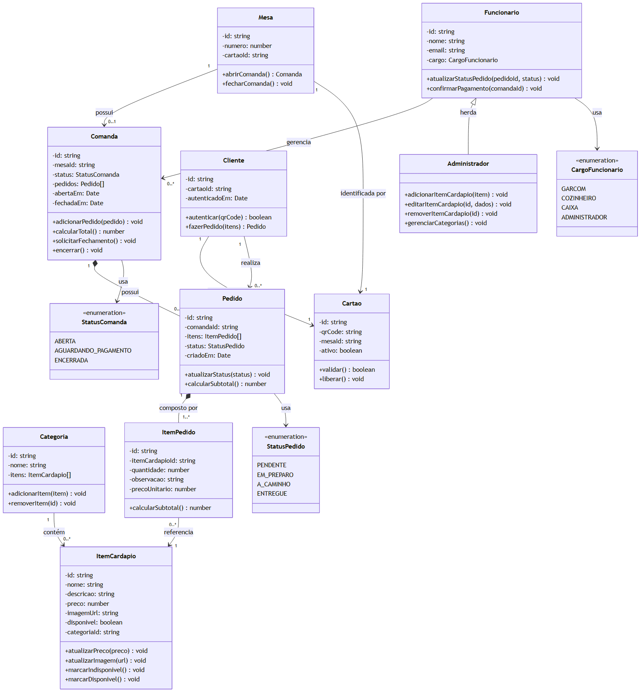

# Diagrama de Classes — cardap.io

> Disciplina de Engenharia de Software 2026.1 — UNIFAP

---

## Legenda de Relacionamentos

| Notação | Significado |
|---------|-------------|
| `"1" --> "0..*"` | Associação (um para muitos) |
| `"1" *-- "0..*"` | Composição (ciclo de vida dependente) |
| `<\|--` | Herança (generalização) |
| `<<enumeration>>` | Enumeração |

---

## Principais Decisões

Veja a justificativa completa em [decisoes-modelagem.md](decisoes-modelagem.md).

---

> Diagrama gerado a partir de [`diagrama-classes.mmd`](diagrama-classes.mmd) com Mermaid CLI.
