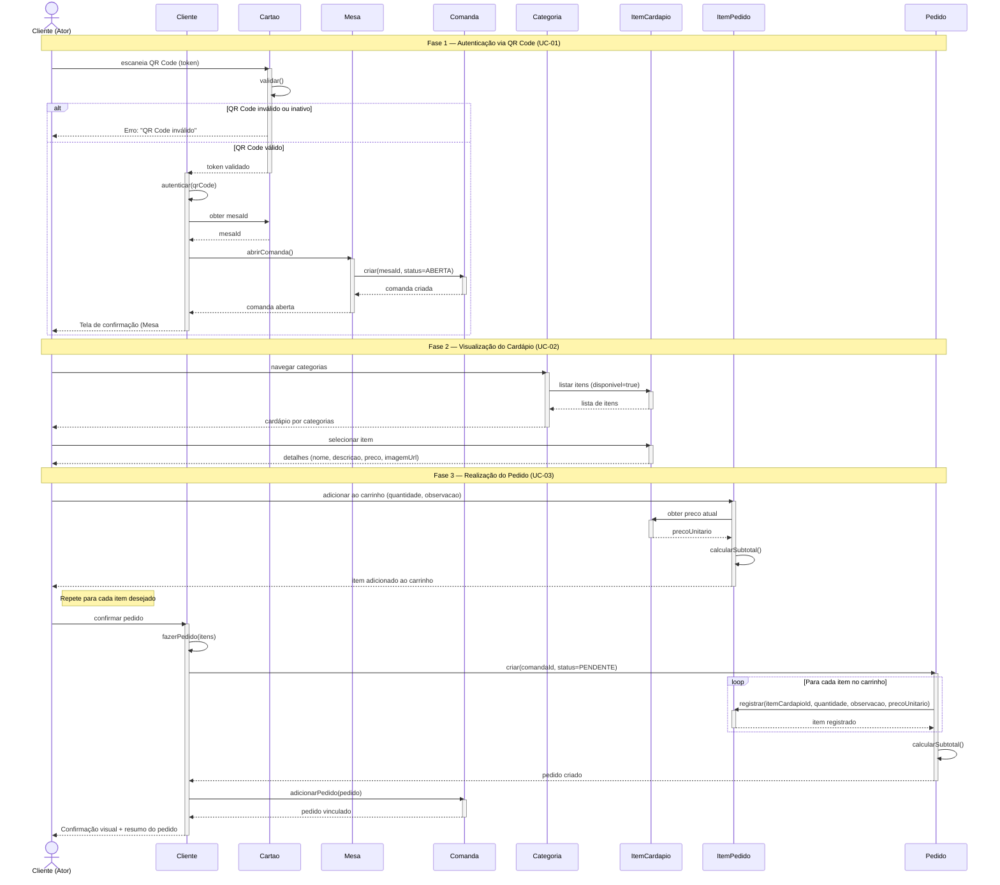
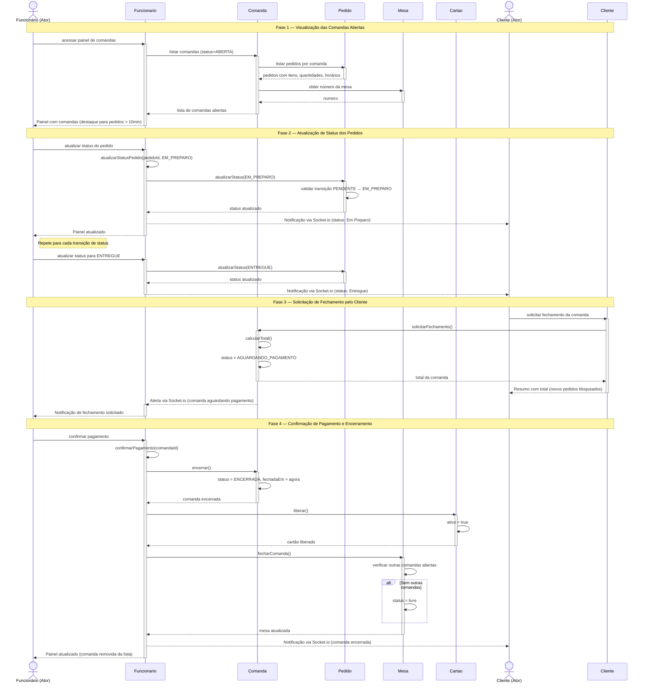

# Diagramas de Sequência — cardap.io

> Disciplina de Engenharia de Software 2026.1 — UNIFAP

---

## Visão Geral

Os diagramas de sequência abaixo ilustram os dois cenários mais complexos do sistema **cardap.io**. As linhas de vida (lifelines) correspondem às classes definidas no [Diagrama de Classes](diagrama-classes.md), garantindo consistência entre os artefatos UML.

---

## Diagrama 1 — Cliente Realiza um Pedido

**Cenário completo:** O cliente escaneia o QR Code → é autenticado → navega pelo cardápio → adiciona itens ao carrinho → confirma o pedido.

**Casos de uso cobertos:** UC-01 (Autenticar via QR Code), UC-02 (Visualizar Cardápio), UC-03 (Realizar Pedido)

---

## Diagrama 2 — Funcionário Gerencia Pedidos e Encerra Comanda

**Cenário completo:** O funcionário visualiza comandas abertas → atualiza o status dos pedidos → o cliente solicita o fechamento → o funcionário confirma o pagamento → a comanda é encerrada e o cartão liberado.

**Casos de uso cobertos:** UC-04 (Gerenciar Comanda), UC-07 (Acompanhar Status — lado do sistema), UC-08 (Solicitar Fechamento)

---

## Notas de Consistência

### Mapeamento Lifelines → Classes

| Lifeline no Diagrama | Classe no Diagrama de Classes | Métodos Utilizados |
|----------------------|-------------------------------|--------------------|
| Cliente | `Cliente` | `autenticar()`, `fazerPedido()` |
| Cartao | `Cartao` | `validar()`, `liberar()` |
| Mesa | `Mesa` | `abrirComanda()`, `fecharComanda()` |
| Comanda | `Comanda` | `adicionarPedido()`, `calcularTotal()`, `solicitarFechamento()`, `encerrar()` |
| Pedido | `Pedido` | `atualizarStatus()`, `calcularSubtotal()` |
| ItemPedido | `ItemPedido` | `calcularSubtotal()` |
| ItemCardapio | `ItemCardapio` | (consulta de preço e disponibilidade) |
| Categoria | `Categoria` | (navegação e listagem de itens) |
| Funcionario | `Funcionario` | `atualizarStatusPedido()`, `confirmarPagamento()` |

### Enumerações Utilizadas

| Enumeração | Valores no Diagrama |
|------------|---------------------|
| `StatusPedido` | PENDENTE → EM_PREPARO → A_CAMINHO → ENTREGUE |
| `StatusComanda` | ABERTA → AGUARDANDO_PAGAMENTO → ENCERRADA |
